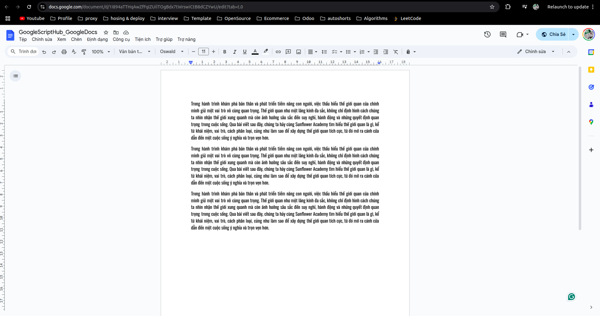
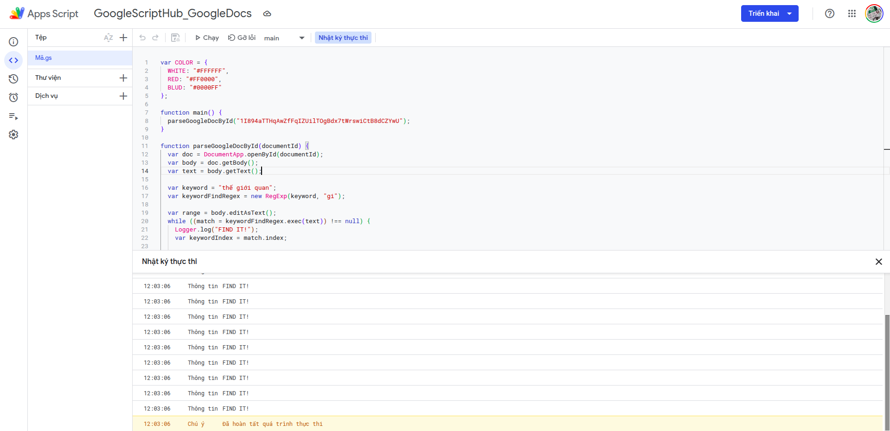
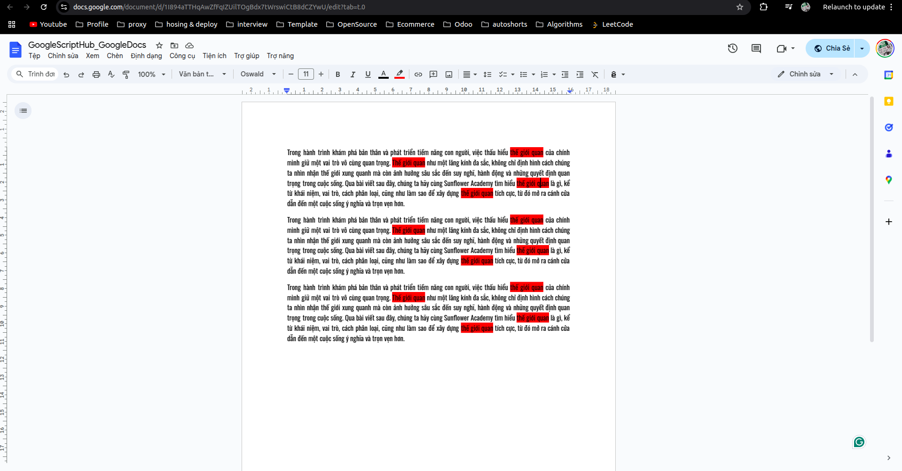

Việc tô màu keyword, hay đoạn văn để highlight (làm nổi bật) là điều không hề còn xa lạ gì với học sinh, sinh viên hay bất kỳ ai làm văn phòng. Giờ có một văn bản cả trăm trang hay nghìn trang thì việc đánh highlight quả thật là không dễ và rất gian nan. Bài viết này mình sẽ hướng dẫn sử dụng Google App Script để đánh highlight keyword cho Google Docs.

Chuẩn bị trước một file Google Docs cần highlight như hình dưới:



Phần URL của file sẽ có dạng `https://docs.google.com/document/d/XXXXX/edit?tab=t.0`, phần `XXXXX` chính là phần ID của file, copy lại ID này để sử dụng cho phần dưới.

Chọn `Tiện ích -> Apps Script` để bắt đầu Code.

Đầu tiên định nghĩa một Object để chứa màu, như vậy code sẽ clear hơn: 

```javascript
var COLOR = {
  WHITE: "#FFFFFF",
  RED: "#FF0000",
  BLUD: "#0000FF"
};
```

Sau đó mình viết hàm đọc và tô màu Google Docs như sau: 

```javascript
function main() {
  parseGoogleDocById("1I894aTTHqAwZfFqIZUilTOgBdx7tWrswiCtB8dCZYwU");
}

function parseGoogleDocById(documentId) {
  var doc = DocumentApp.openById(documentId);
  var body = doc.getBody();
  var text = body.getText();

  var keyword = "thế giới quan";
  var keywordFindRegex = new RegExp(keyword, "gi");

  var range = body.editAsText();
  while ((match = keywordFindRegex.exec(text)) !== null) {
    Logger.log("FIND IT!");
    var keywordIndex = match.index; 
    
    // Tô màu từ khóa
    range.setBackgroundColor(keywordIndex, keywordIndex + keyword.length - 1, COLOR.RED);
  }
}
```

- Hàm `parseGoogleDocById` nhận đầu vào là ID của Google Docs (Cách lấy ID đã được trình bày ở phần trên)
- `new RegExp(keyword, "gi");`: Regex với tham số `g` cho phép tìm tất cả, `i` cho phép tìm không phân biệt hoa thường

Chạy chương trình với hàm chính là hàm `main` sẽ có được kết quả như sau: 



