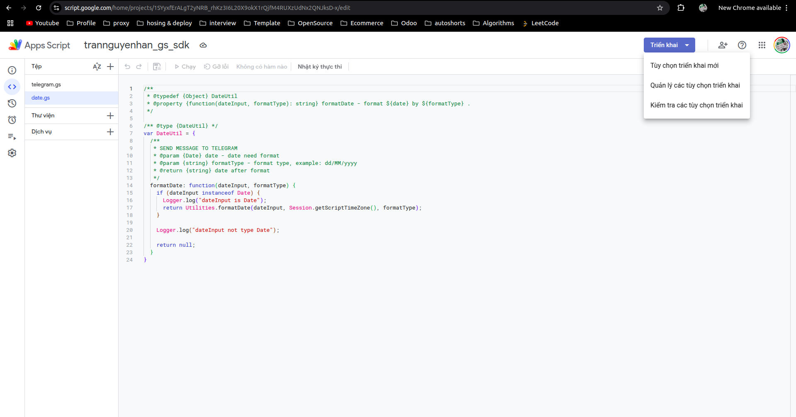
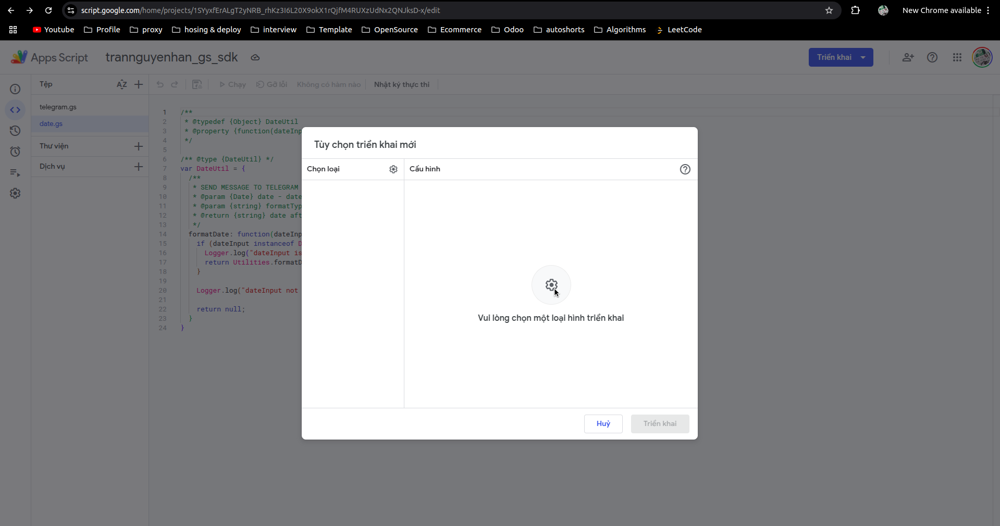
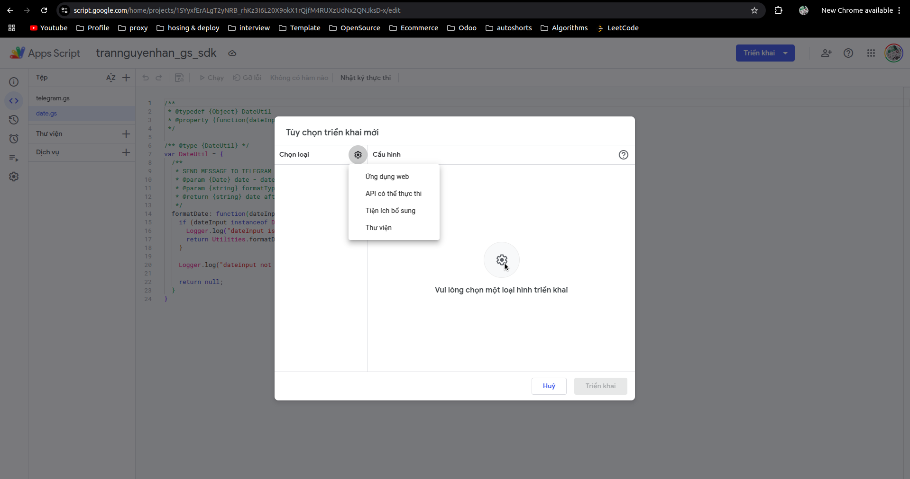
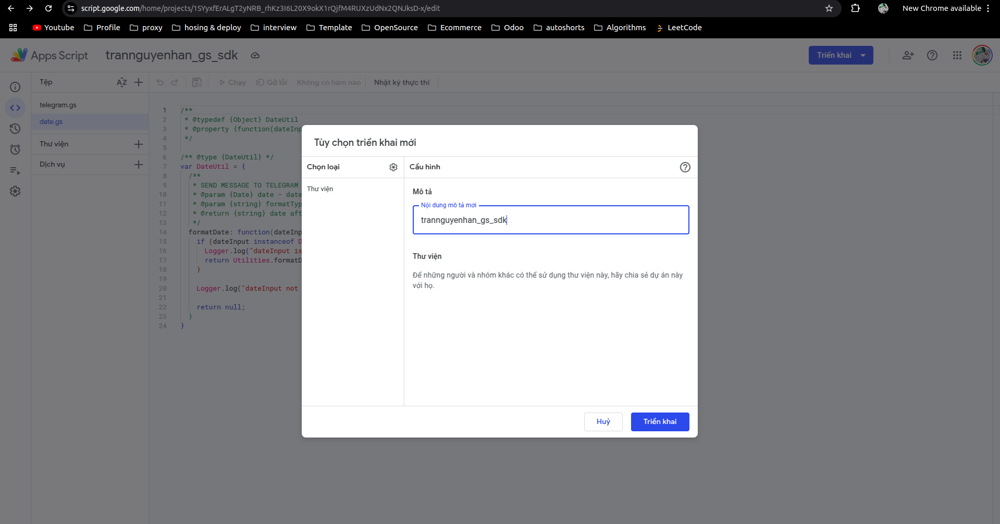
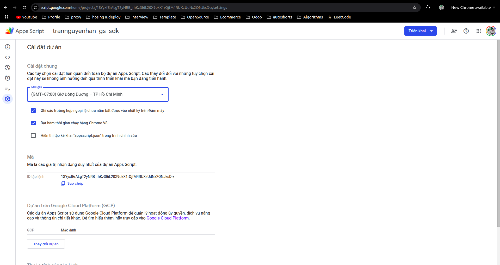
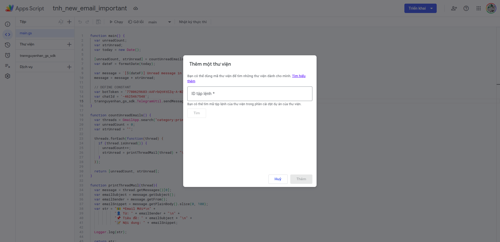

## Triển khai thư viện cho một đoạn mã Google App Script

Cũng giống như các ngôn ngữ khác, để nâng cao tính tái sử dụng code thì Google App Script cho phép triển khai code thành thư viện (lib) và có thể dễ dàng thêm (import) vào các dự án khác để sử dụng.

Khi bạn có một đoạn mã muốn triển khai, nhìn vào góc phải trên cùng nhấp vào triển khai, chọn tùy chọn triển khai mới:





Cửa sổ tùy chọn triển khai mới hiện ra, chọn phần răng cưa và chọn vào thư viện:



Nhập mô tả cho tùy chọn triển khai và bấm triển khai. Xong khi triển khai xong nó có một đoạn mã là mã ID triển khai, ID này không phải là ID dùng để import thư viện nên bạn không cần để ý tới ID này và tránh nhầm lẫn:



## Sử dụng thư viện 

Truy cập phần cài đặt dự án và copy ID tập lệnh dùng để import vào dự án khác:



Tại một script bất kỳ ở phần thử viện, nhấp vao dấu `+` và dán ID tập lệnh vừa copy ở phía trên: 



Sử dụng thư viện vừa thêm vào dự án như sau: 

```javascript
trannguyenhan_gs_sdk.TelegramUtil.sendMessage(message, botToken, chatId);
```

- Với `trannguyenhan_gs_sdk` là tên thư viện tương ứng

- Mọi người có thể sử dụng `trannguyenhan_gs_sdk` để xử lý gửi thông báo qua Telegram với method `GET`, `POST` qua ID `1SYyxfErALgT2yNRB_rhKz3I6L20X9okX1rQjfM4RUXzUdNx2QNJksD-x`