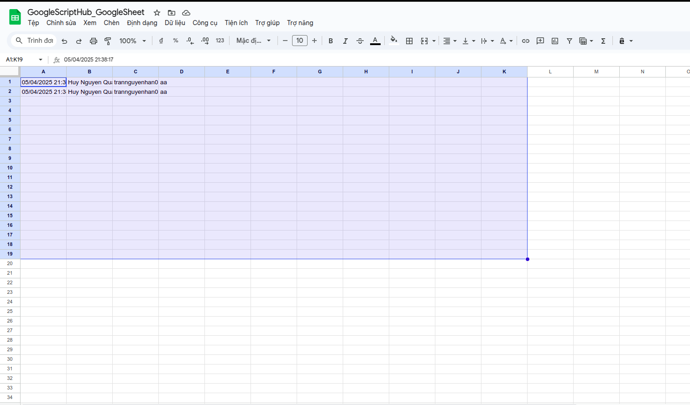

## Mục tiêu

Tạo một web form đơn giản (HTML) chạy bằng Google Apps Script. Khi người dùng submit form, dữ liệu sẽ được lưu vào Google Sheet.

## Cấu trúc

Gồm 1 file html để hiển thị giao diện cho người dùng, và 1 file `main.gs` để xử lý logic.

* `index.html`
* `main.gs`

## Tạo Project

* Truy cập https://script.google.com

* Chọn “New project”

* Đặt tên cho dự án, `GoogleScriptHub_SimpleWebForm`

## Code file `main.gs`

```javascript
function doGet() {
  return HtmlService.createHtmlOutputFromFile('index');
}

function submitForm(formData) {
  const sheet = SpreadsheetApp.openById("1GVxZZm8jE7nzlZGKnIy4rFPiojtcXL_dOJ___OW7NeA").getSheetByName("SimpleWebForm");
  sheet.appendRow([new Date(), formData.name, formData.email, formData.message]);
  return "Dữ liệu đã được gửi!";
}

```

- `1GVxZZm8jE7nzlZGKnIy4rFPiojtcXL_dOJ___OW7NeA`: là ID Google Sheet, phần URL của Google Sheets có dạng `https://docs.google.com/spreadsheets/d/XXXXX/edit?gid=863700560#gid=863700560` và `XXXXX` là ID của Google Sheet

- `SimpleWebForm` là tên Sheet sẽ chứa dữ liệu

Lưu ý: file `index.html` được gọi từ hàm `doGet` trong file `main.gs`. hàm `doGet`, `doPost` là 2 hàm đặc biệt trong Google App Script để xử lý request từ bên ngoài ứng dụng, 1 trong 2 hàm bắt buộc phải có nếu muốn xuất bản đoạn mã dưới dạng ứng dụng web, xem chi tiết về hàm `doGet`, `doPost` và các tham số của hàm tại [https://developers.google.com/apps-script/guides/web](https://developers.google.com/apps-script/guides/web).

## Code file `index.html`

File `index.html` sẽ là một form dạng đơn giảm như sau: 

```html
<!DOCTYPE html>
<html>
  <head>
    <base target="_top">
    <style>
      body {
        font-family: Arial;
        padding: 2rem;
      }
      input, textarea {
        display: block;
        width: 100%;
        margin-bottom: 1rem;
        padding: 0.5rem;
        font-size: 1rem;
      }
    </style>
  </head>
  <body>
    <h2>Liên hệ với chúng tôi</h2>
    <form id="contact-form">
      <input type="text" name="name" placeholder="Tên của bạn" required />
      <input type="email" name="email" placeholder="Email" required />
      <textarea name="message" rows="4" placeholder="Nội dung"></textarea>
      <input type="submit" value="Gửi" />
    </form>
    <p id="response"></p>

    <script>
      const form = document.getElementById("contact-form");
      form.addEventListener("submit", function(e) {
        e.preventDefault();
        const formData = Object.fromEntries(new FormData(form));
        google.script.run
          .withSuccessHandler(msg => document.getElementById("response").innerText = msg)
          .submitForm(formData);
        form.reset();
      });
    </script>
  </body>
</html>
```

- `google.script.run` giúp gửi dữ liệu từ HTML về Google App Script thông qua hàm tương ứng, như trong ví dụ là hàm `submitForm`

## Triển khai ứng dụng web

Chọn `Triển Khai -> Tùy chọn triển khai mới -> Ứng dụng web`, nhập mô tả và chọn quyền truy cập sau đó nhấn vào triển khai: 


Sau khi bấm triển khai, Google sẽ xuất bản website của bạn và trả lại thông báo popup trên màn hinh gồm `ID triển khai` và `URL`. Copy URL và dán vào trình duyệt để xem thành quả:


Nhập thông tin, bấm submit thử và xem lại thông tin đã nhập trong Google Sheet:



Xem mã nguồn của Project tại: [https://script.google.com/d/1ipdLBwzw6i5GJ8mxYmAAeKvJZhaMJgICTLNeV84KBesOBcngrFv2Xov2/edit?usp=sharing](https://script.google.com/d/1ipdLBwzw6i5GJ8mxYmAAeKvJZhaMJgICTLNeV84KBesOBcngrFv2Xov2/edit?usp=sharing) và kết quả sau khi submit tại Sheet `SimpleWebForm` của file [https://docs.google.com/spreadsheets/d/1GVxZZm8jE7nzlZGKnIy4rFPiojtcXL_dOJ___OW7NeA](https://docs.google.com/spreadsheets/d/1GVxZZm8jE7nzlZGKnIy4rFPiojtcXL_dOJ___OW7NeA).