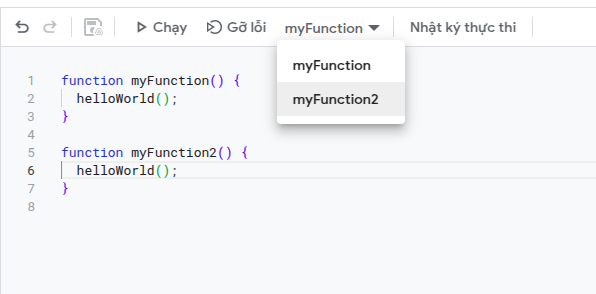

## Hàm main và chỉ định hàm chạy đầu tiên

Với Google App Script thì bất cứ hàm nào cũng có thể là hàm `main` (nơi chương trình bắt đầu chạy), chỉ cần chỉ định rõ là được.

Trước khi chạy, trên thanh công cụ, chỉ định hàm cần chạy sau đó bấm chạy.


Nếu bạn định nghĩa 2 hàm trong 1 file (ấn save trước khi thực hiện bước tiếp theo), khi chọn hàm chạy sẽ liệt kê toàn bộ hàm trong file đó, chọn hàm tương ứng, hệ thống sẽ bắt đầu chạy từ hàm đó. 



## Hàm gọi hàm

Google App Script được xây dựng dựa trên Javascript nên syntax cũng sẽ gần giống, để gọi hàm được định nghĩa trong cùng 1 file chúng ta gọi bình thường như trong Javascript:

```javascript
function myFunction2() {
  helloWorld();
}

function myFunction3() {
  myFunction2();
}
```

Vậy từ 2 file khác nhau thì sau, bạn cũng có thể thấy hàm `helloWorld` được định nghĩa trong 1 file khác từ bài viết trước được gọi trong hàm `myFunction2`. Việc gọi các function từ các file khác nhau là bình thường **như trong cùng** 1 file, khi chạy Google Apps Script tự động gộp tất cả các file lại thành một, vì vậy Google App Script tự động nhận biết và gọi được hàm từ file khác mà không cần import như các ngôn ngữ lập trình khác.

Vậy nêu 2 hàm có cùng tên ở 2 file trong cùng một dự án thì sao, Google tải toàn bộ file `.gs` mà không đảm bảo thứ tự và phiên bản cuối cùng của hàm được giữ lại. Vì vậy, chúng ta nên quy chuẩn đặt tên hàm giữa các file để tránh bị trùng.
