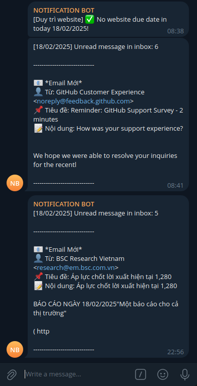

Có thể vì công việc bận rộn mà tới cuối ngày chúng ta có thể quên check mail, một ứng dụng viết bằng Google App Script hoàn toàn miễn phí có thể thông báo tới Telegram để nhắc nhở mọi người số mail còn lại chưa được xem và có thể nhanh chóng đi kiểm tra nếu quên.

Google App Script cung câp cho chúng ta hàm để lấy các email trong hòm thư chính như sau: 


```javascript
GmailApp.search("category:primary", 0, 50);
```

Đối tượng trả về của hàm trên là `GmailThread`. `GmailThread` là gì? Khi các bạn gửi mail thì người nhận có thể reply lại email của bạn, bạn lại có thể tiếp tục reply email đó, tổng hợp cả cuộc hội thoại đó là `GmailThread`. Vì thế với các email được gửi một chiều mà cần kiểm tra chưa đọc chỉ cần lấy thread đầu tiên là được (vì chúng ta còn chưa xem chứ nói gì reply lại email đó).

Trước hết, chúng ta sẽ tạo một hàm để in thông tin của một thread email: 

```javascript
function printThreadMail(thread){
  var message = thread.getMessages()[0]; 
  var emailSubject = message.getSubject();
  var emailSender = message.getFrom();
  var emailSnippet = message.getPlainBody().slice(0, 100); 
  var str = "📧 *Email Mới*\n" +
            "👤 Từ: " + emailSender + "\n" +
            "📌 Tiêu đề: " + emailSubject + "\n" +
            "📝 Nội dung: " + emailSnippet;
    
  Logger.log(str);

  return str;
}
```

Bây giờ tạo thêm 1 hàm nữa để đếm số lượng email chưa được đọc trong hòm thư:


```javascript
function countUnreadEmails() {
  var threads = GmailApp.search("category:primary", 0, 50);
  var unreadCount = 0;
  var strUnread = "";

  threads.forEach(function(thread) {
    if (thread.isUnread()) {
      unreadCount++;
      if(strUnread == ""){
        strUnread = printThreadMail(thread) + "\n\n-----------------------------";
      }
    }
  });

  return [unreadCount, strUnread];
}
```

Hàm này `strUnread` chỉ cần lấy là nội dung email đầu tiên thôi, vì lấy nhiều khi gửi Telegram qua method GET cũng không gửi được.

Hàm chính của chúng ta sẽ như sau: 

```javascript
function main() {
  var unreadCount;
  var strUnread;
  var today = new Date();

  [unreadCount, strUnread] = countUnreadEmails();
  var dateF = formatDate(today);

  var message = `[${dateF}] Unread message in inbox: ${unreadCount}\n\n-----------------------------\n\n`;
  message = message + strUnread;

  // DEFINE CONSTANT
  var botToken = '<botToken>';  
  var chatId = '<chatId>'; 
  sendMessage(message, botToken, chatId);
}
```

Hàm `sendMessage` và `formatDate` để định dạng lại ngày tháng và gửi tin nhắn qua Telegram đã được giới thiệu ở bài [Tạo Bot Telegram Thông Báo Công Việc Từ Google Sheets Bằng Google Apps Script](https://google-script-hub.github.io/send-notification-to-telegram). Trong bài sau mình sẽ hướng dẫn các bạn sử dụng thư viện để tránh việc lặp đi lặp lại code nhiều lần không cần thiết.

Vậy là xong, bây giờ lập lịch cho nó chạy khoảng 10-11h tối, lập lịch như nào có thể theo dõi lại bài viết [Lập lịch (Schedule)](https://google-script-hub.github.io/schedule).

Kết quả khi chạy sẽ ra như sau: 

