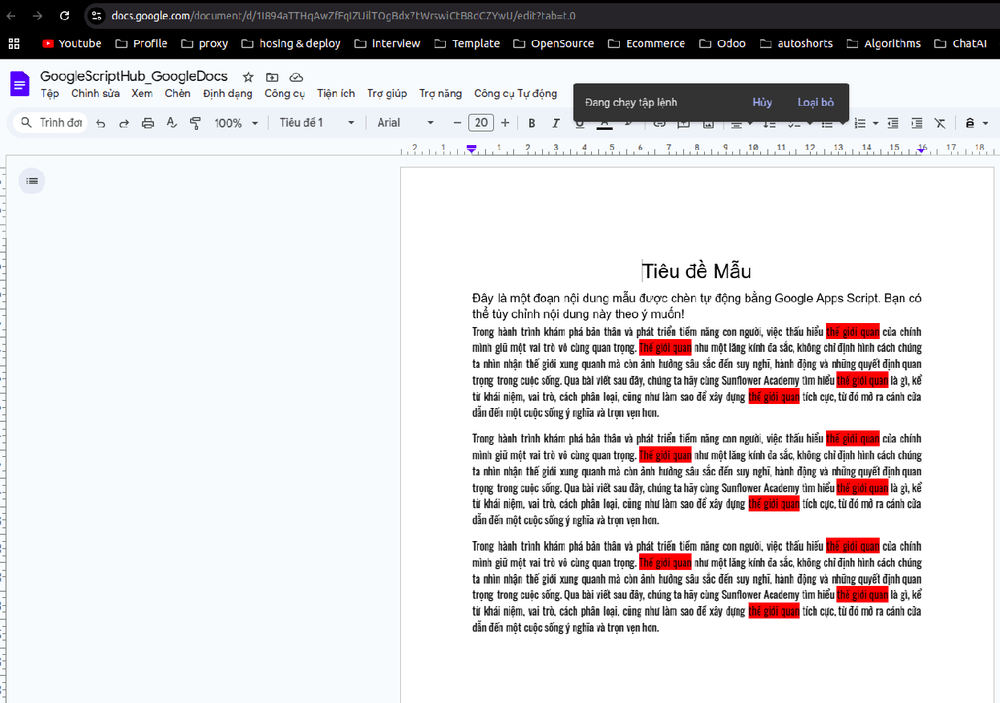

Mở một App Script trong file Google Doc mà muốn xử lý chèn dữ liệu theo hướng dẫn bài viết [Tạo ứng dụng Google App Script từ Google Docs](/create-google-app-script-from-google-docs).

Trong Google Apps Script, hàm `onOpen()` là một hàm đặc biệt (special trigger) được tự động gọi khi tài liệu (Google Docs, Sheets, Slides, hoặc Forms) được mở. Điều này rất hữu ích vì nó giúp chúng nó không cần phải vào script để chạy nó thủ công. Nó thường được sử dụng để thực hiện các tác vụ khởi tạo, chẳng hạn như:

- Tạo menu
- Khởi tạo thiết lập: thông báo, thống kê

Tạo menu mỗi khi mở Google Docs như sau: 

```javascript
function onOpen() {
  var ui = DocumentApp.getUi();
  ui.createMenu('Công cụ Tự động')
    .addItem('Chèn Tiêu đề & Nội dung', 'insertFormattedText')
    .addToUi();
}
```

Bây giờ sẽ viết chức năng cho hàm `insertFormattedText`: 


```javascript
function insertFormattedText() {
  var doc = DocumentApp.getActiveDocument();
  var body = doc.getBody();
  var cursor = doc.getCursor(); 

  if (cursor) {
    var header = body.insertParagraph(body.getChildIndex(cursor.getElement()), "Tiêu đề Mẫu");
    header.setHeading(DocumentApp.ParagraphHeading.HEADING1); 
    header.setAlignment(DocumentApp.HorizontalAlignment.CENTER); 

    var content = body.insertParagraph(body.getChildIndex(header) + 1, 
      "Đây là một đoạn nội dung mẫu được chèn tự động bằng Google Apps Script. " +
      "Bạn có thể tùy chỉnh nội dung này theo ý muốn!");
    content.setAlignment(DocumentApp.HorizontalAlignment.JUSTIFY);
    content.setFontSize(12); 
    content.setFontFamily("Arial"); 
  } else {
    DocumentApp.getUi().alert("Vui lòng đặt con trỏ vào vị trí cần chèn!");
  }
}
```

Quay lại file Google Doc để kiểm tra kết quả:

