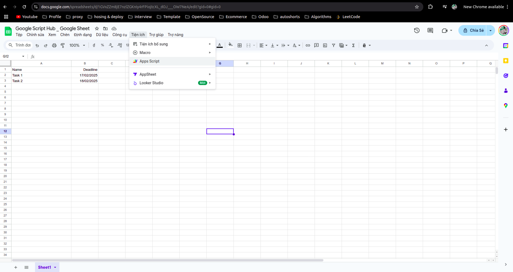
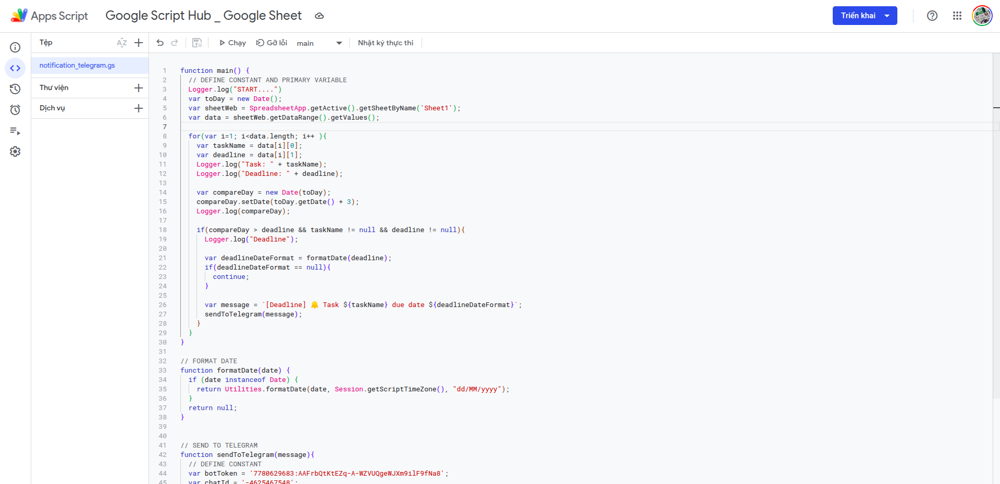
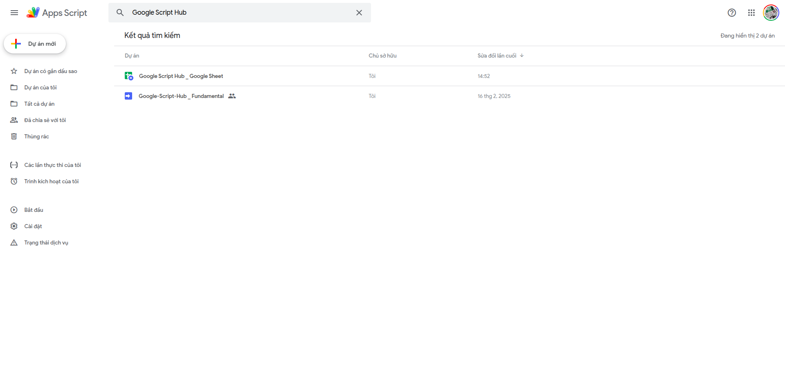

Một ứng dụng Google App Script có thể tạo độc lập từ [https://script.google.com/home/](https://script.google.com/home/), tuy nhiên hoàn toàn có thể tạo ứng dụng Google App Script từ một ứng dụng Google Sheet, ứng dụng được tạo sẽ chỉ "phục vụ" riêng Google Sheet này.

Tạo một ứng dụng Google Sheet trước, lưu ý là phải là Google Sheet, nếu ứng là một file Excel (`.xls`, `.xlsx`) được tải lên và mở qua Google Sheet sẽ không sử dụng được Google App Script.

Chọn Tiện Ích -> Chọn App Script để tạo Google App pScript cho Google Sheet:

Sau đó tiến hành code như bình thường như các ứng dụng Google App Script được tạo từ trang chủ, chúng ta cũng có thể tìm thấy ứng dụng Google App Script tạo từ Google Sheet tại trang chủ của App Script [https://script.google.com/home/](https://script.google.com/home/):

