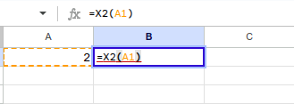

Có thể khi sử dụng Google Sheet đôi ít lần chúng ta nghĩ rằng các hàm như `SUM, AVERAGE,...` liệu đã đủ chưa, nhỡ nhu cầu cần thêm thì sao. Không sao, nếu cần thêm thì chúng ta có thể viết thêm dựa vào Google App Script.

Bản thân các hàm mà chúng ta tìm hiểu ở các bài trước hoàn toàn có thể sử dụng trong các trang tính để làm một hàm tính toán mới. Ví dụ có hàm sau: 

```javascript
function X2(a) {
  return a * 2;
}
```

Nhiệm vụ hàm là trả lại kết quả gấp đôi so với đầu vào, lưu lại Script, tắt cửa sổ và quay lại trang tính, sử dụng hàm:

```excel
=X2(A1)
```



