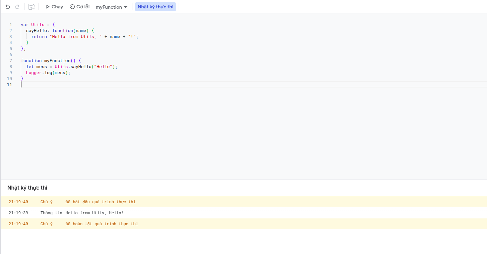

Theo mình khi lập trình Google App Script chỉ cần lập trình theo chức năng và lập trình hàm là được, tuy nhiên vì dựa trên Javascript nên Google App Script vẫn có Object.

Object trong Google App Script được khai báo và goi như sau: 

```javascript
var Utils = {
  sayHello: function(name) {
    return "Hello from Utils, " + name + "!";
  }
};

function myFunction() {
  let mess = Utils.sayHello("Hello");
  Logger.log(mess);
}

```

Chọn funciton `myFunction`, xong đó bấm chạy để xem kết quả:

