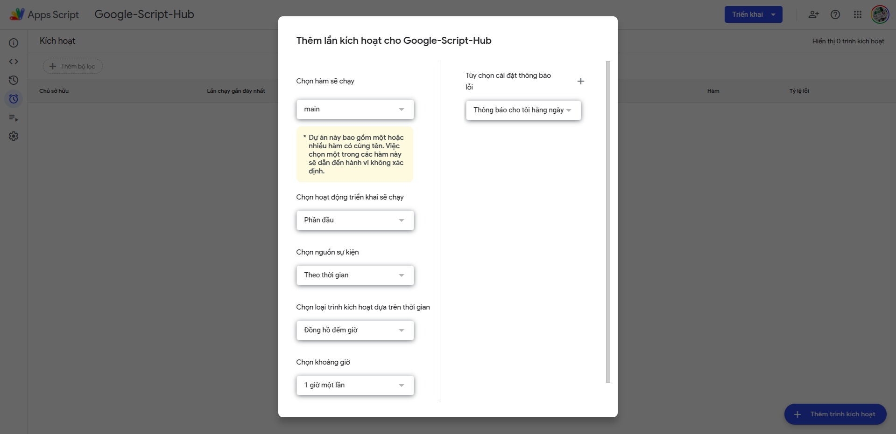

Với lập trình viên có thể chúng ta dùng nhiều khái niệm là `crontab`, `schedule` là tạo Job chạy ngầm. Job này có thể là backjob xử lý tác vụ ngầm nào đó, hay là Job xử lý thông báo, job gửi mail,... Với Google App Script có thể tạo một Job như vậy hoàn toàn miễn phí mà không cần phải triển khai trên VPS hay máy tính cá nhân nào cả.

Chọn vào phần đồng hồ (thực thi) -> Chọn thêm trình kích hoạt:

Chọn hàm chính mà trình kích hoạt sẽ chạy, sau đó chọn loại trình kích hoạt là: phút, giờ, ngày, tuần hoặc tháng.

Trong các bài tiếp theo mình sẽ trình bày về tạo một ứng dụng thông báo hàng ngày vào Telegram bằng Google App Script.