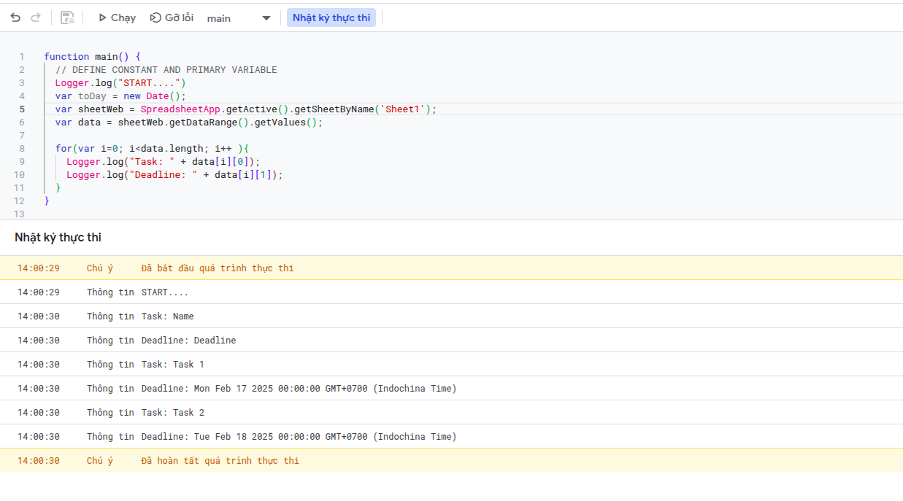
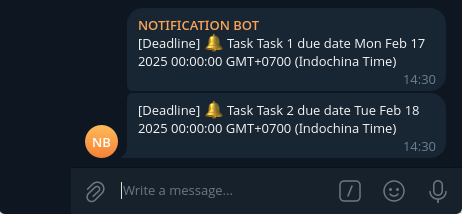
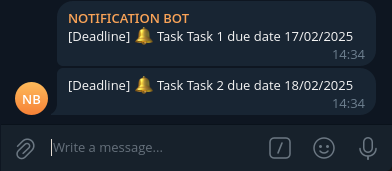

## Chuẩn bị

Bây giờ bạn lập một kế hoạch trên Google Sheet, đưa ra deadline cho mình theo từng đầu mục kế hoạch. Tuy nhiên vì lo lắng quên bạn muốn làm một ứng dụng thông báo cho mình hàng ngày để thúc giục làm việc và cảnh báo khi tới hạn. Không cần tới các ứng dụng bằng ngôn ngữ Java, Python, Javascript,... với cơ sở dữ liệu MySQL, PostgreSQL,... triển khai trên các server với VPS đắt đỏ, với Google App Script chúng ta hoàn toàn có thể làm ra một ứng dụng cảnh báo, nhắc nhở hàng ngày thông báo tới Telegram một cách hoàn toàn miễn phí.

Tạo bot mới với [BotFather](https://core.telegram.org/bots/tutorial), tạo một group mới và thêm bot vừa tạo vào group chung này (Để tạo bot thông báo qua Telegram trước hết cần biết cách thông báo qua Telegram như thế nào, mọi người có thể tham khảo qua đường link [https://core.telegram.org/bots/api](https://core.telegram.org/bots/api), trong bài viết này đề cập tới sử dụng trên Google App Script nên sẽ không đi sâu vào việc tạo bot như nào): 


## Bắt đầu code nào!

Sau khi có bot, một group để bot thông báo thì chúng ta tiến hành bắt tay vào code ứng dụng. Trước hết, định nghĩa một hàm nhận vào một `message` thông báo và gửi nó tới Telegram: 

```javascript
// SEND TO TELEGRAM
function sendToTelegram(message){
  // DEFINE CONSTANT
  var botToken = '<botToken>';  
  var chatId = '<chatId>'; 

  // SEND DATA AND SEND MESSAGE TO TELEGRAM
  try {
    var url = `https://api.telegram.org/bot${botToken}/sendMessage?chat_id=${chatId}&text=${encodeURIComponent(message)}`;
    UrlFetchApp.fetch(url);
    Logger.log("Send message successfully!");
  } catch(error){
    Logger.log("Error: " + error.message);
  }
}
```

- `botToken`: là token của bot vừa tạo qua [BotFather](https://core.telegram.org/bots/tutorial) ở bước trên
- `chatId`: phần này trên ứng dụng desktop sẽ không thấy, bạn truy cập Telegram qua ứng dụng web và xem chatId trên URL trình duyệt

Bây giờ sẽ xử lý dữ liệu từ Google Sheet để thông báo, Google Sheet có dữ liệu như sau: 

<table>
  <tr>
    <th>Name</th>
    <th>Deadline</th>
  </tr>
  <tr>
    <td>Task 1</td>
    <td>17/02/2025</td>
  </tr>
  <tr>
    <td>Task 2</td>
    <td>18/02/2025</td>
  </tr>
</table>

Ứng dụng cần làm là thông báo vào Telegram những Task còn 3 ngày nữa là tới Deadline. Trước hết phải đọc dữ liệu từ Google Sheet:

```javascript
function main() {
  // DEFINE CONSTANT AND PRIMARY VARIABLE
  Logger.log("START....")
  var sheetWeb = SpreadsheetApp.getActive().getSheetByName('Sheet1');
  var data = sheetWeb.getDataRange().getValues(); 

  for(var i=0; i<data.length; i++ ){
    Logger.log("Task: " + data[i][0]);
    Logger.log("Deadline: " + data[i][1]); 
  }
}
```

Khi chạy sẽ thấy dữ liệu đọc ra như sau:



Bản thân cột Deadline kiểu dữ liệu là `Date` nên khi đọc từ Google App Script nó cũng sẽ mang kiểu dữ liệu là `Date`, nên không cần convert nữa. Giờ khi loop qua mỗi hàng sẽ so sánh Deadline nếu Deadline = ngày hiện tại + 3 thì sẽ thông báo qua Telegram, ngày hiện tại được khai báo trong Google App Script như sau: 

```javascript
var toDay = new Date();
```

Hàm hoàn thiện sẽ như sau: 

```javascript
function main() {
  // DEFINE CONSTANT AND PRIMARY VARIABLE
  Logger.log("START....")
  var toDay = new Date();
  var sheetWeb = SpreadsheetApp.getActive().getSheetByName('Sheet1');
  var data = sheetWeb.getDataRange().getValues(); 

  for(var i=1; i<data.length; i++ ){
    var taskName = data[i][0];
    var deadline = data[i][1];
    Logger.log("Task: " + taskName);
    Logger.log("Deadline: " + deadline); 

    var compareDay = new Date(toDay);
    compareDay.setDate(toDay.getDate() + 3);
    Logger.log(compareDay);

    if(compareDay > deadline && taskName != null && deadline != null){
      Logger.log("Deadline");
      var message = `[Deadline] 🔔 Task ${taskName} due date ${deadline}`;
      sendToTelegram(message);
    }
  }
}
```

Sau khi chạy sẽ có thông báo vào Telgram:



Chúng ta thấy là thông báo về ngày đang chưa được format, vì vậy giờ sẽ thêm vào một hàm nữa để format ngày về định dạng `dd/MM/yyyy`: 

```javascript
// FORMAT DATE
function formatDate(date) {
  if (date instanceof Date) {
    return Utilities.formatDate(date, Session.getScriptTimeZone(), "dd/MM/yyyy");
  }
  return null; 
}
```

Vậy hàm `main` sau khi thêm `formatDate` sẽ như sau: 

```javascript
function main() {
  // DEFINE CONSTANT AND PRIMARY VARIABLE
  Logger.log("START....")
  var toDay = new Date();
  var sheetWeb = SpreadsheetApp.getActive().getSheetByName('Sheet1');
  var data = sheetWeb.getDataRange().getValues(); 

  for(var i=1; i<data.length; i++ ){
    var taskName = data[i][0];
    var deadline = data[i][1];
    Logger.log("Task: " + taskName);
    Logger.log("Deadline: " + deadline); 

    var compareDay = new Date(toDay);
    compareDay.setDate(toDay.getDate() + 3);
    Logger.log(compareDay);

    if(compareDay > deadline && taskName != null && deadline != null){
      Logger.log("Deadline");

      var deadlineDateFormat = formatDate(deadline);
      if(deadlineDateFormat == null){
        continue;
      }

      var message = `[Deadline] 🔔 Task ${taskName} due date ${deadlineDateFormat}`;
      sendToTelegram(message);
    }
  }
}
```

Sau khi chạy sẽ được kết quả: 



Code hoàn chỉnh của cả file: 

```javascript
function main() {
  // DEFINE CONSTANT AND PRIMARY VARIABLE
  Logger.log("START....")
  var toDay = new Date();
  var sheetWeb = SpreadsheetApp.getActive().getSheetByName('Sheet1');
  var data = sheetWeb.getDataRange().getValues(); 

  for(var i=1; i<data.length; i++ ){
    var taskName = data[i][0];
    var deadline = data[i][1];
    Logger.log("Task: " + taskName);
    Logger.log("Deadline: " + deadline); 

    var compareDay = new Date(toDay);
    compareDay.setDate(toDay.getDate() + 3);
    Logger.log(compareDay);

    if(compareDay > deadline && taskName != null && deadline != null){
      Logger.log("Deadline");

      var deadlineDateFormat = formatDate(deadline);
      if(deadlineDateFormat == null){
        continue;
      }

      var message = `[Deadline] 🔔 Task ${taskName} due date ${deadlineDateFormat}`;
      sendToTelegram(message);
    }
  }
}

// FORMAT DATE
function formatDate(date) {
  if (date instanceof Date) {
    return Utilities.formatDate(date, Session.getScriptTimeZone(), "dd/MM/yyyy");
  }
  return null; 
}


// SEND TO TELEGRAM
function sendToTelegram(message){
  // DEFINE CONSTANT
  var botToken = '<botToken>';  
  var chatId = '<chatId>'; 

  // SEND DATA AND SEND MESSAGE TO TELEGRAM
  try {
    var url = `https://api.telegram.org/bot${botToken}/sendMessage?chat_id=${chatId}&text=${encodeURIComponent(message)}`;
    UrlFetchApp.fetch(url);
    Logger.log("Send message successfully!");
  } catch(error){
    Logger.log("Error: " + error.message);
  }
}

```

Bây giờ lập lịch để tự động chạy mỗi ngày, theo dõi thêm bài [Schedule](https://google-script-hub.github.io/schedule).

Xem mã nguồn qua phần `Tiện ích -> App Script` của file [https://docs.google.com/spreadsheets/d/1GVxZZm8jE7nzlZGKnIy4rFPiojtcXL_dOJ___OW7NeA/edit?usp=sharing](https://docs.google.com/spreadsheets/d/1GVxZZm8jE7nzlZGKnIy4rFPiojtcXL_dOJ___OW7NeA/edit?usp=sharing)