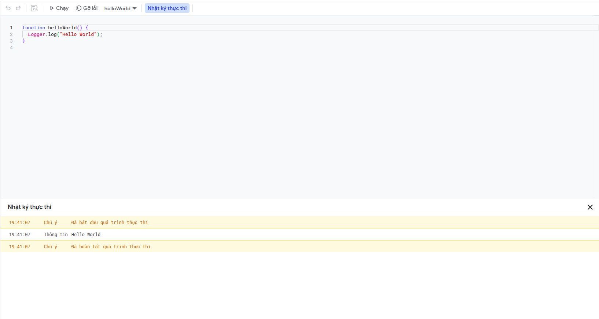

### Google App Script là gì?

Google Apps Script là một nền tảng phát triển dựa trên JavaScript, được lưu trữ trên đám mây, cho phép bạn tích hợp và tự động hóa các tác vụ trên các sản phẩm của Google. Nó cho phép bạn viết mã để thực hiện các tác vụ theo chương trình trên các sản phẩm của Google, như tạo các hàm tùy chỉnh trong Google Trang tính, thêm trình đơn tùy chỉnh, hộp thoại và thanh bên vào Google Tài liệu, Trang tính và Biểu mẫu, cũng như xuất bản các ứng dụng web độc lập hoặc được nhúng trong Google Sites.

Ngoài ra, Apps Script cho phép bạn xây dựng các ứng dụng tự động hóa (ngắn gọn là Schedule hay Crontab) hoặc kết nối với các dịch vụ của bên thứ ba từ trong Google Workspace, và chia sẻ giải pháp của bạn với người khác trên Google Workspace Marketplace.

Quản lý các dự án Google App Script tại [https://script.google.com/home](https://script.google.com/home).

## Hello World 

Google App Script sử dụng `Logger` để in thông tin ra console thuận tiện cho lập trình viên có thể debug và xem các giá trị. Một chương trình in ra màn hình dòng chữ `Hello World` với Google App Script đơn giản như sau: 

```javascript
function helloWorld() {
  Logger.log("Hello World");
}
```



Ấn chạy và xem kết quả được trả ra dưới console.

Bạn có thắc mắc là lớp `Logger` được lấy ở đâu không? và xem cách sử dụng chúng như nào? Google định nghĩa cho chúng ta 2 loại dịch vụ:

<ul>
  <li>Google Workspace Service: là các dịch vụ cho phép bạn truy cập dữ liệu của các ứng dụng Google Workspace, chẳng hạn như Drive, Gmail và Sheets và các ứng dụng khác của Google như Bản đồ và Dịch.</li>

  <li>Utility services: là các dịch vụ không được kết nối với một sản phẩm Google cụ thể. Họ cho phép bạn làm những việc như log, tạo HTML, nén dữ liệu và hơn thế nữa.</li>
</ul>

Xem docs Google tại: [https://developers.google.com/apps-script/reference](https://developers.google.com/apps-script/reference)

Cách sử dụng của từng dịch vụ chính sẽ được mình đề cập trong các bài viết sau với các ví dụ cụ thể, dễ hiểu.

